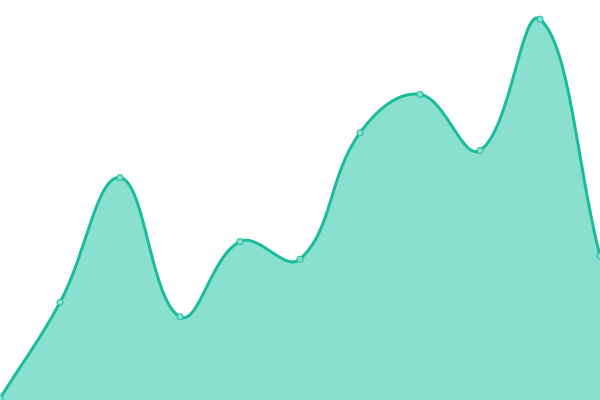

# [📈 Live Status](https://status.fairdataihub.org): <!--live status--> **🟥 Complete outage**

This repository contains the open-source uptime monitor and status page for [FAIR Data Innovations Hub](https://fairdataihub.org), powered by [Upptime](https://github.com/upptime/upptime).

With [Upptime](https://upptime.js.org), you can get your own unlimited and free uptime monitor and status page, powered entirely by a GitHub repository. We use [Issues](https://github.com/fairdataihub/uptime/issues) as incident reports, [Actions](https://github.com/fairdataihub/uptime/actions) as uptime monitors, and [Pages](https://status.fairdataihub.org) for the status page.

<!--start: status pages-->
<!-- This summary is generated by Upptime (https://github.com/upptime/upptime) -->
<!-- Do not edit this manually, your changes will be overwritten -->
<!-- prettier-ignore -->
| URL | Status | History | Response Time | Uptime |
| --- | ------ | ------- | ------------- | ------ |
|  [Organization Website](https://fairdataihub.org) | 🟥 Down | [organization-website.yml](https://github.com/fairdataihub/uptime/commits/HEAD/history/organization-website.yml) | 

 233ms
     
 | 

<a href="https://status.fairdataihub.org/history/organization-website">98.89%</a>
    

|  [SODA for SPARC Documentation](https://docs.sodaforsparc.io) | 🟥 Down | [soda-for-sparc-documentation.yml](https://github.com/fairdataihub/uptime/commits/HEAD/history/soda-for-sparc-documentation.yml) | 

 232ms
     
 | 

<a href="https://status.fairdataihub.org/history/soda-for-sparc-documentation">98.94%</a>
    

|  [FAIRshare Documentation](https://docs.fairshareapp.io) | 🟥 Down | [fai-rshare-documentation.yml](https://github.com/fairdataihub/uptime/commits/HEAD/history/fai-rshare-documentation.yml) | 

 225ms
     
 | 

<a href="https://status.fairdataihub.org/history/fai-rshare-documentation">99.00%</a>
    

|  [Developer Documentation](https://dev.fairdataihub.org) | 🟥 Down | [developer-documentation.yml](https://github.com/fairdataihub/uptime/commits/HEAD/history/developer-documentation.yml) | 

 216ms
     
 | 

<a href="https://status.fairdataihub.org/history/developer-documentation">99.04%</a>
    

|  [AI-READI Website](https://aireadi.org) | 🟥 Down | [ai-readi-website.yml](https://github.com/fairdataihub/uptime/commits/HEAD/history/ai-readi-website.yml) | 

 231ms
     
 | 

<a href="https://status.fairdataihub.org/history/ai-readi-website">99.09%</a>
    

|  [FAIRshare Authentication](https://auth.fairshareapp.io) | 🟥 Down | [fai-rshare-authentication.yml](https://github.com/fairdataihub/uptime/commits/HEAD/history/fai-rshare-authentication.yml) | 

 237ms
     
 | 

<a href="https://status.fairdataihub.org/history/fai-rshare-authentication">99.13%</a>
    

|  [Upload Website](https://upload.fairdataihub.org) | 🟥 Down | [upload-website.yml](https://github.com/fairdataihub/uptime/commits/HEAD/history/upload-website.yml) | 

 233ms
     
 | 

<a href="https://status.fairdataihub.org/history/upload-website">99.17%</a>
    

|  [SPARClink](https://sparclink.vercel.app) | 🟥 Down | [spar-clink.yml](https://github.com/fairdataihub/uptime/commits/HEAD/history/spar-clink.yml) | 

 138ms
     
 | 

<a href="https://status.fairdataihub.org/history/spar-clink">99.21%</a>
    

|  [Open Graph Image Generation Studio](https://kalai.fairdataihub.org) | 🟥 Down | [open-graph-image-generation-studio.yml](https://github.com/fairdataihub/uptime/commits/HEAD/history/open-graph-image-generation-studio.yml) | 

 243ms
     
 | 

<a href="https://status.fairdataihub.org/history/open-graph-image-generation-studio">99.25%</a>
    

|  [Umami](https://umami.fairdataihub.org) | 🟥 Down | [umami.yml](https://github.com/fairdataihub/uptime/commits/HEAD/history/umami.yml) | 

 217ms
     
 | 

<a href="https://status.fairdataihub.org/history/umami">99.29%</a>
    

|  [Alt Text Generator for Images](https://alt.fairdataihub.org) | 🟥 Down | [alt-text-generator-for-images.yml](https://github.com/fairdataihub/uptime/commits/HEAD/history/alt-text-generator-for-images.yml) | 

 201ms
     
 | 

<a href="https://status.fairdataihub.org/history/alt-text-generator-for-images">99.33%</a>
    

|  [Status Page](https://status.fairdataihub.org) | 🟥 Down | [status-page.yml](https://github.com/fairdataihub/uptime/commits/HEAD/history/status-page.yml) | 

 605ms
     
 | 

<a href="https://status.fairdataihub.org/history/status-page">0.00%</a>
    

<!--end: status pages-->

[**Visit our status website →**](https://status.fairdataihub.org)

## 📄 License

- Powered by: [Upptime](https://github.com/upptime/upptime)
- Code: [MIT](./LICENSE) © [FAIR Data Innovations Hub](https://fairdataihub.org)
- Data in the `./history` directory: [Open Database License](https://opendatacommons.org/licenses/odbl/1-0/)
